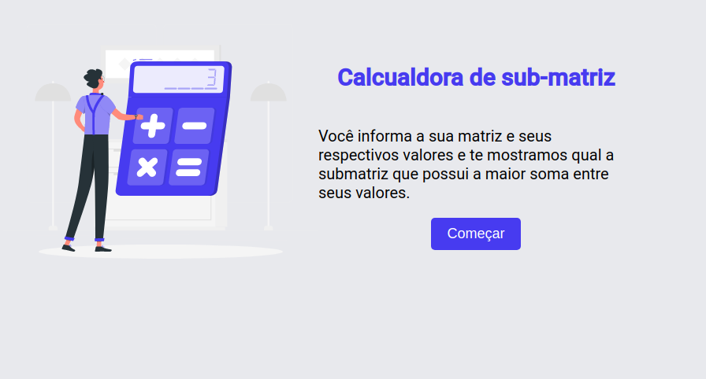
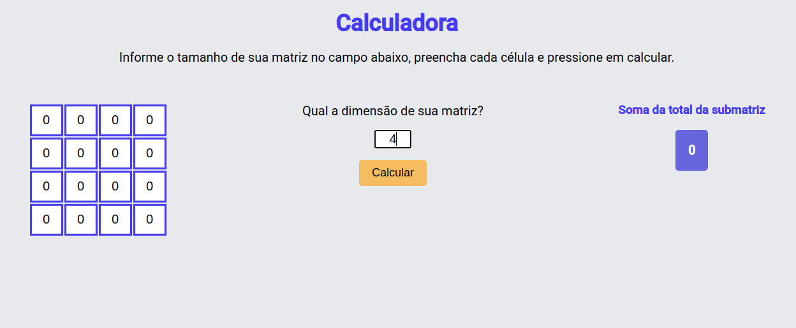
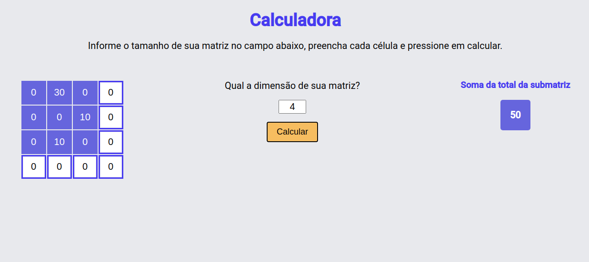
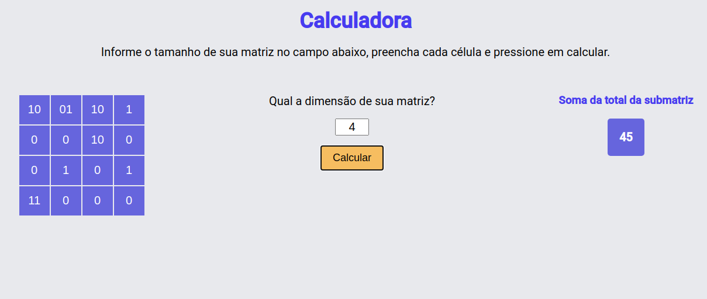

# [PD Máxima Submatriz](https://pd-submatrix.netlify.app/)

**Número da Lista**: 4 
**Conteúdo da Disciplina**: Programação Dinâmica<Xbr>

## Alunos

| Matrícula  | Aluno                       |
| ---------- | --------------------------- |
| 17/0109208 | Luis Henrique Pereira Taira |
| 17/0010341 | Gabriel Davi Silva Pereira  |

## Sobre

Uma calculadora que encontra a submatriz com maior soma de uma matriz quadrada.

## Screenshots

## Deploy

Se preferir, acesse o [site](https://pd-submatrix.netlify.app/) para utilizar a aplicação

## Instalação

**Linguagem**: Javascript 
**Framework**: React 

É necessário possuir um instalador de pacotes JS (eg. [Yarn](https://yarnpkg.com/) ou [NPM](https://www.npmjs.com/)) e um navegador de internet.

#### Passos para instalação

- 1 -> Execute um git clone do repositório

- 2 -> Navegue até a pasta web através de seu terminal

- 3 -> Execute o comando `yarn install`

## Uso

#### Para executar o projeto locamente, siga os seguintes passos:

- 1 -> Acesse a pasta web/

- 2 -> Execute o comando `yarn start` ou `npm start`

- 3 -> O projeto estará em execução no endereço `localhost:3000`

* Ou usar o deploy clicando [aqui](https://projeto-de-algoritmos.github.io/Greed_Auto_Planner/)

## Outros

O projeto utiliza o algoritmo de cálculo de maior submatriz [1](https://www.techiedelight.com/find-maximum-sum-submatrix-present-given-matrix/) .

## Vídeo

Veja o vídeo [aqui](assets/video.mp4)
